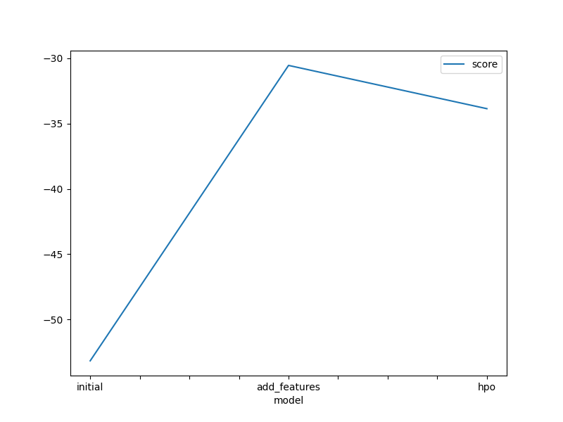
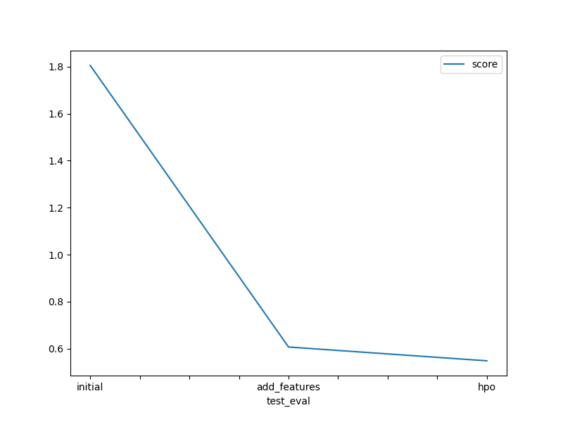

# Report: Predict Bike Sharing Demand with AutoGluon Solution
#### Piotr Grabysz

## Initial Training
### What did you realize when you tried to submit your predictions? What changes were needed to the output of the predictor to submit your results?
I had no problems with submitting my predictions. However, before submitting them, I realised that the predictions are float values, and the count variable should probably be an integer.
I rounded the predictions to the nearest integer with `.round()` and cast to integer type with `.astype("int")`. I guess that the question relates to this problem.
The template notebook also suggests to set all negative value to 0. However, I didn't encounter any negative predictions.

### What was the top ranked model that performed?
The top ranked model was WeightedEnsemble_L3, with these parameters:

```python
{
    'use_orig_features': False,
    'max_base_models': 25,
    'max_base_models_per_type': 5,
    'save_bag_folds': True
}
```
The model score was 1.80549. It seems to be quite bad. I looked at the public leaderboard and the first 50 best submissions are between 0.338 and 0.369.

## Exploratory data analysis and feature creation
### What did the exploratory analysis find and how did you add additional features?
Firstly, it turned out there is a "datetime" column, which is just a plain string (type "object"). It makes a lot of sense to extract month, day and hour out of the raw datetime.

Secondly, some of the columns contain only a few values. They are treated as integers by default. However, in reality, they should be treated as categorical variables.
The template suggest to make "season" and "weather" categoricals. However, I also found that "holiday" and "working" day seems to be categoricals with just two possible values.
I casted them to categoricals as well. Furthermore, "holiday" and "working" are highly correlated: when "holiday" is True, "workingday" is always False (quite obviously).
It could be beneficial to remove one of these variables. However, I didn't try it here.

By looking at histograms, I can see that:

* All 4 seasons are represnted evenly
* There is much more non-holiday days then holidays
* Similarly, there is more working days then non-working days
* The most common weather is 1, corresponding to; Clear, Few clouds, Partly cloudy, Partly cloudy). Each next value is less common.
* Wind speed, albeit being numerical type, is a little bit similar to weather: more extreme speeds as increasingly less common.
* Both temp and atemp have a distribution which looks a little bit like normal. There are centered around 20-25 degrees.
* Humudity is bounded by 0 and 100 (obviously). It's a little skewed to the right.
* 

### How much better did your model preform after adding additional features and why do you think that is?
TODO: Add your explanation

## Hyper parameter tuning
### How much better did your model preform after trying different hyper parameters?
TODO: Add your explanation

### If you were given more time with this dataset, where do you think you would spend more time?
TODO: Add your explanation

### Create a table with the models you ran, the hyperparameters modified, and the kaggle score.
|model|learning_rate|num_leaves|feature_fraction|score|
|--|--|--|--|--|
|initial|0.03|128|0.9|1.80549|
|add_features|0.03|128|0.9|0.60716|
|hpo|0.10|31|1.0|0.60716|

### Create a line plot showing the top model score for the three (or more) training runs during the project.



### Create a line plot showing the top kaggle score for the three (or more) prediction submissions during the project.



## Summary
TODO: Add your explanation
