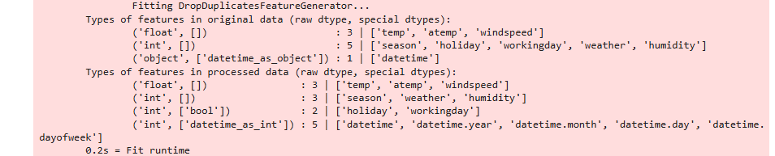

# Report: Predict Bike Sharing Demand with AutoGluon Solution
#### Piotr Grabysz

## Initial Training
### What did you realize when you tried to submit your predictions? What changes were needed to the output of the predictor to submit your results?
I had no problems with submitting my predictions. The template suggested to replace negative values with 0.
However, I didn't encounter any negative predictions. 

I thought that predictions being float values would be a problem,
because the "count" variable should probably be an integer. 
So in the first iteration I rounded the predictions to the nearest integer.
But in the next steps I passed count as floats and it worked as well. 

### What was the top ranked model that performed?
The top ranked model was WeightedEnsemble_L3, with these parameters:

```python
{
    'use_orig_features': False,
    'max_base_models': 25,
    'max_base_models_per_type': 5,
    'save_bag_folds': True
}
```
The model score was 1.80549. It seems to be quite bad. I looked at the public leaderboard and the first 50 best submissions are between 0.338 and 0.369.

## Exploratory data analysis and feature creation
### What did the exploratory analysis find and how did you add additional features?
Firstly, it turned out that there is a "datetime" column, which is just a plain string (type "object"). It makes a lot of sense to extract month, day and hour out of the raw datetime.

Secondly, some of the columns contain only a few values. By default, they are treated as integers.
However, in reality, they should be treated as categorical variables.
The template suggest to make "season" and "weather" categorical. However,
I also found that "holiday" and "workingday" seem to be categorical with just two possible values.
I casted them to categorical as well. Furthermore, "holiday" and "workingday" are highly correlated:
when "holiday" is True, "workingday" is always False (quite obviously).
It could be beneficial to remove one of these variables. However, I didn't try it here.

By looking at histograms, I can see that:

* All 4 seasons are represented evenly.
* There is much more non-holiday days than holidays.
* Similarly, there is more working days than non-working days.
* The most common weather is 1, corresponding to; Clear, Few clouds, Partly cloudy, Partly cloudy). Each next value is less common.
* Wind speed, albeit being numerical type, is a little bit similar to weather: more extreme speeds as increasingly less common.
* Both temp and atemp have a distribution which looks a little bit like normal distribution. There are centered around 20-25 degrees.
* Humidity is bounded by 0 and 100 (obviously). It's a little skewed to the right.
* Count looks like a log-normal variable: it's very skewed to the left.

### How much better did your model preform after adding additional features and why do you think that is?
The best model again is WeightedEnsemble_L3, however it's performance on the test data is much better,
reaching the score of 0.60716.

It must be due to two reasons:
1. Raw datatime string doesn't contain any useful information for models. However, we can expect that numerical values
for month, day and hour are strongly correlated with the bike count.
For example winter months probably have less bike rentals, and there are probably some peak hours when the demand for
bikes is highest. It's more difficult for me to say if day is relevant or not. For example can I expect that e.g.
first day of month has different demand for bikes than the second day? Probably not. After some consideration, 
the day of week could be more informative than day.
2. "holiday", "workingday", "season" and "weather" are categorical. When their type was numerical, they were treated by
models as variables which could have potentially infinite number of possible values, rather than some small set of values.
I think that tree-based models use different rules when creating a node based on categorical vs numerical value.

I think it's also worth noting what AutoGluon does automatically and what it does not.
For example, it looks like it tries to parse datetime on its own. 
Here is a screenshot of the output I got when fitting the initial model:

It looks like it automatically extracted year, month, day and day of week.
On the other hand, it didn't detect that "season" and "weather" are categorical.

It's also interesting that despite extracting year, month and day the initial model performed poorly. 
Maybe hour (which was not extracted) is the most important in this case?

## Hyper parameter tuning
### How much better did your model preform after trying different hyper parameters?
After trying different hyperparameters, the model achieved 0.54842 on the test score, which is a small improvement.

I have to honestly say that I had no idea what hyperparameters to try.
It seems to me like the great advantage of AutoGluon is that it works out of the box.
However, trying to tweak it manually makes it much more difficult.
Because in the previous runs, out of the individual models the LightGBM model seemed to perform best, I decided to only
tweak hyperparameters of LightGBM:
```python
.fit(
    train_data=train,
    time_limit=600,
    presets="best_quality",
    hyperparameters={
        "GBM": {
            "learning_rate": 0.1, "num_leaves": 31, "feature_fraction": 1.0,
        }
    },
    auto_stack=True
)
```

I just set default values I found in the LightGBM package. Although it resulted in better test score, 
it looks like a little bit random guess to me.

I also set `auto_stack=True`, because I read in the documentation that it can increase quality of predictions. 
However, I realised later that this variable is True by default when preset is "best_quality".

### If you were given more time with this dataset, where do you think you would spend more time?
I think I would spend more time on feature engineering before jumping to hyperparameters optimization.

For example, it seems that some of the variables are correlated: temp and atemp, season and month, holiday and working day.
I would try removing some of them and seeing what happens.

The target variable in this case is highly skewed to the left. 
It might cause that the model overfits to larger count values. I would try using a different metric,
for example root mean squared logarithmic error.

Lastly, I would also try running the AutoGluon models for longer time period, e.g. on hour instead of 10 minutes. 

### Create a table with the models you ran, the hyperparameters modified, and the kaggle score.
|model|learning_rate|num_leaves|feature_fraction|score|
|--|--|--|--|--|
|initial|0.03|128|0.9|1.80549|
|add_features|0.03|128|0.9|0.60716|
|hpo|0.10|31|1.0| 0.54842 |

### Create a line plot showing the top model score for the three (or more) training runs during the project.


### Create a line plot showing the top kaggle score for the three (or more) prediction submissions during the project.


## Summary
The feature engineering showed to yield the greatest improvement in the test score. 
It's worth noting that it was just a basic feature engineering. 
Could spending more time in this step make even greater improvements?

The hyperparameters tuning also improved the score, however not as dramatically as intelligent feature engineering.
Interestingly, it performed better on the test set despite being slightly worse on the training set.
Maybe the trees in the LightGBM models were overfitting with num_leaves=128, which I later set to be just 31? 
However, tuning hyperparameters for AutoGluon (apart from playing around with preset and time) 
seems quite difficult for me. This step made some improvements over add_feautures step, 
but it took me much longer to complete than the previous two steps.
